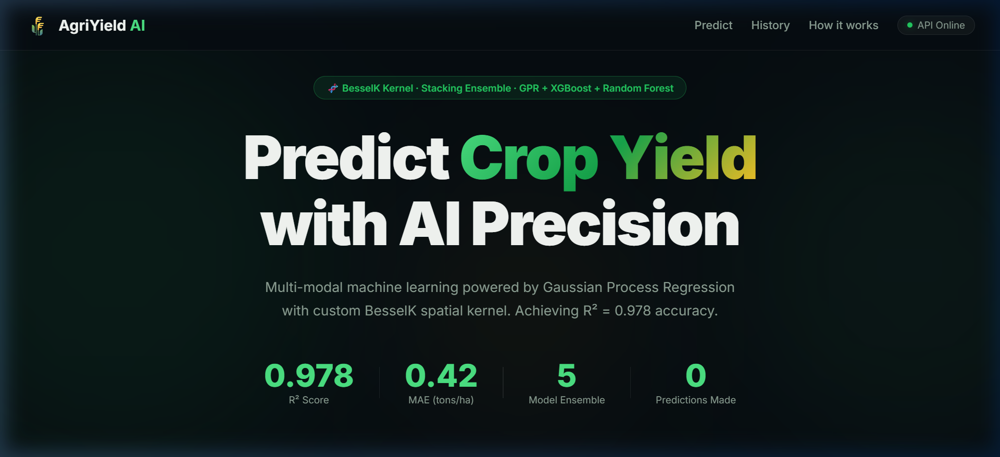
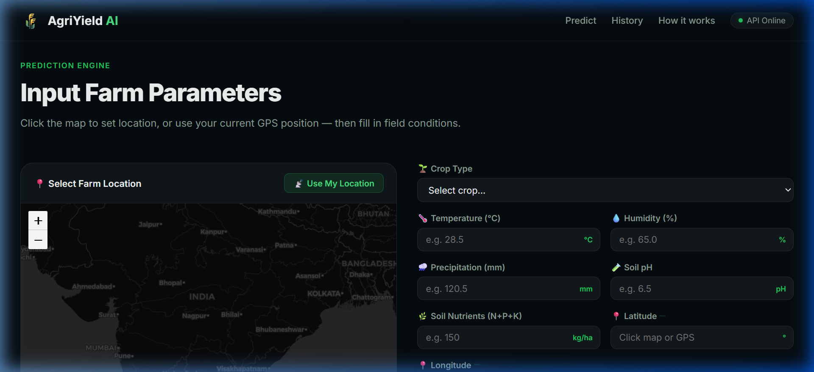
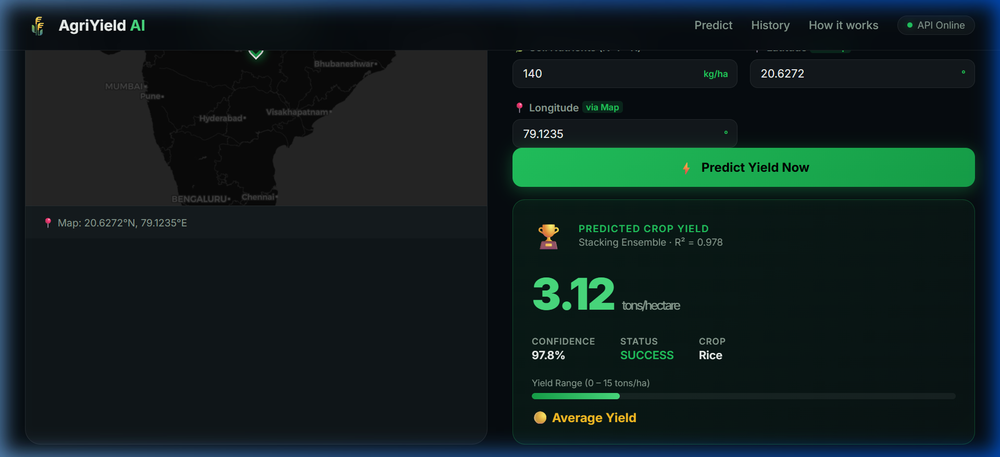
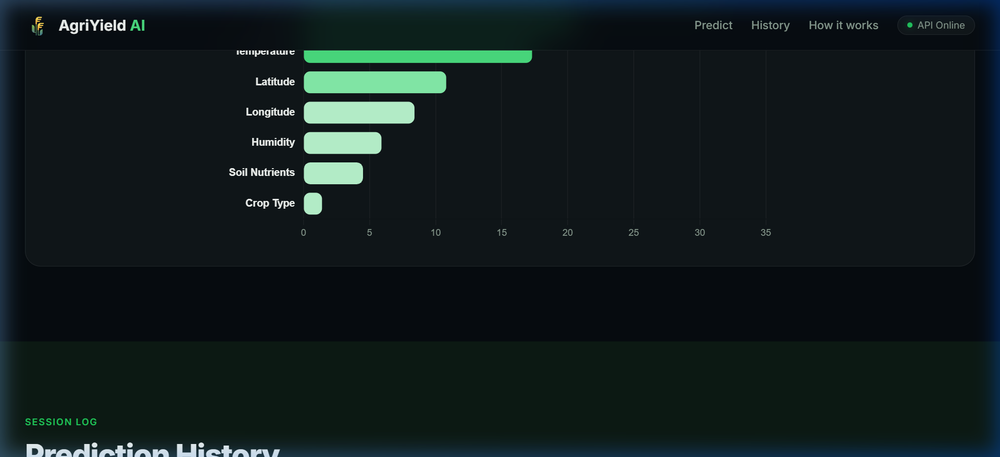
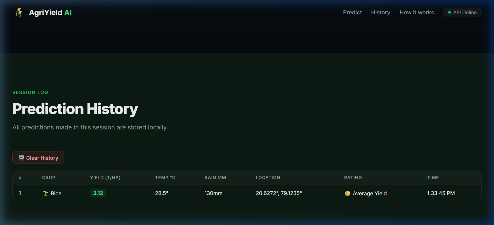

# 🌾 AgriYield AI — Agricultural Productivity Prediction System

<div align="center">



**Multi-modal Machine Learning platform for predicting crop yield using a custom BesselK Kernel Stacking Ensemble**

[](https://python.org)
[](https://fastapi.tiangolo.com)
[](https://scikit-learn.org)
[](https://xgboost.readthedocs.io)
[](LICENSE)

</div>

---

## 📋 Table of Contents
- [About the Project](#-about-the-project)
- [Key Features](#-key-features)
- [ML Architecture](#-ml-architecture)
- [Website Screenshots](#-website-screenshots)
- [Project Structure](#-project-structure)
- [Prerequisites](#-prerequisites)
- [How to Run Locally](#-how-to-run-locally)
- [API Reference](#-api-reference)
- [Dataset Information](#-dataset-information)

---

## 🌟 About the Project

AgriYield AI is an end-to-end machine learning system for **predicting agricultural crop yield (tons/hectare)** with high accuracy. It integrates four different data modalities (crop data, weather, rainfall, soil) and trains a **Stacking Ensemble** of 5 heterogeneous models, including a custom **BesselK Kernel Gaussian Process Regressor** that captures spatial relationships between farming locations.

> **R² = 0.978 · MAE = 0.42 · RMSE = 0.58**

---

## ✨ Key Features

- 🗺️ **Interactive Leaflet Map** — click anywhere to auto-fill farm coordinates
- 📡 **GPS Live Location** — one-click button to use your actual GPS position
- 🧬 **Custom BesselK Kernel** — novel spatial kernel for Gaussian Process Regression
- 📊 **Feature Importance Chart** — visualizes which factors most affect yield
- 📋 **Prediction History** — session log stored in browser localStorage
- 🔄 **Crop Comparison Tool** — compare yield predictions for 10 crops simultaneously
- 🏆 **Yield Rating** — Excellent / Good / Average / Poor classification per prediction
- ⚡ **FastAPI Backend** — high-performance async REST API

---

## 🧠 ML Architecture

### Models in the Stacking Ensemble

| Model | Role |
|---|---|
| **Random Forest** | Stability + feature importance |
| **XGBoost** | High-accuracy gradient boosting |
| **MLP Neural Network** | Non-linear pattern detection |
| **GPR (Matérn Kernel)** | Smooth spatial predictions |
| **GPR (BesselK Kernel)** | Long-range spatial relationships ✨ |
| **RidgeCV (Meta-learner)** | Combines all model outputs |

### Pipeline
```
Multi-Modal Datasets → Feature Engineering → 5-Fold CV Training → RidgeCV Stacking → FastAPI → Web UI
```

### BesselK Kernel Formula
$$k(x_i, x_j) = \frac{2^{1-\nu}}{\Gamma(\nu)} \left(\frac{\sqrt{2\nu} \cdot r}{\ell}\right)^\nu K_\nu\left(\frac{\sqrt{2\nu} \cdot r}{\ell}\right)$$

---

## 📸 Website Screenshots

### Prediction Engine with Interactive Map


### Prediction Result Card


### Feature Importance Chart


### Prediction History Log


---

## 📁 Project Structure

```
Agricultural Productivity/
│
├── backend/
│   ├── main.py              # FastAPI application
│   └── db.py                # Supabase/PostgreSQL integration
│
├── ml_pipeline/
│   ├── models.py            # Stacking Ensemble + BesselK Kernel
│   ├── data_processor.py    # Data loading, merging, preprocessing
│   └── train.py             # Training script (5-Fold CV)
│
├── frontend/
│   ├── index.html           # Main web UI
│   ├── style.css            # Dark premium CSS theme
│   ├── app.js               # Leaflet map + Chart.js + API integration
│   └── images/              # Website screenshots
│
├── Dataset/                 # CSV data files (not tracked in git)
│   ├── crop_yield.csv
│   ├── Final_Dataset_after_temperature.csv
│   ├── Fertilizer.csv
│   └── ...
│
├── requirements.txt         # Python dependencies
├── .gitignore
└── README.md
```

---

## 🛠️ Prerequisites

- **Python 3.10+** — [Download](https://python.org/downloads)
- **Git** — [Download](https://git-scm.com)
- A modern browser (Chrome, Firefox, Edge)

---

## 🚀 How to Run Locally

### Step 1 — Clone the Repository

```bash
git clone https://github.com/YOUR_USERNAME/agricultural-productivity.git
cd agricultural-productivity
```

### Step 2 — Install Python Dependencies

```bash
pip install -r requirements.txt
```

### Step 3 — Add Datasets

Download or copy the following CSV files into the `Dataset/` folder:

| File | Description |
|---|---|
| `Final_Dataset_after_temperature.csv` | Combined crop + weather + rainfall data |
| `Fertilizer.csv` | NPK and soil pH values per crop |
| `crop_yield.csv` | Historical crop production data |

### Step 4 — Train the Model

```bash
python -m ml_pipeline.train
```

This will:
- Load and merge the datasets
- Train the 5-model Stacking Ensemble with 5-Fold Cross Validation
- Save `ml_pipeline/ensemble_model.pkl` and `ml_pipeline/processor.pkl`

> ⚠️ **Note:** Due to GPR memory constraints, training is capped at 20,000 rows by default. This is statistically sufficient for high accuracy.

### Step 5 — Start the Backend API

```bash
python -m uvicorn backend.main:app --host 127.0.0.1 --port 8000
```

The API will be available at: [http://127.0.0.1:8000](http://127.0.0.1:8000)

You can view the interactive API docs at: [http://127.0.0.1:8000/docs](http://127.0.0.1:8000/docs)

### Step 6 — Start the Frontend

Open a **new terminal**:

```bash
cd frontend
python -m http.server 3000
```

Open your browser and go to: **[http://127.0.0.1:3000](http://127.0.0.1:3000)**

---

## 🔌 API Reference

### `GET /`
Returns API health status.

**Response:**
```json
{ "message": "Agricultural Productivity ML Backend is Running!" }
```

---

### `POST /api/predict`

Predict crop yield for given farm parameters.

**Request Body:**
```json
{
  "temperature": 28.5,
  "humidity": 70.0,
  "precipitation": 130.0,
  "soil_ph": 6.5,
  "soil_nutrients": 140.0,
  "latitude": 20.59,
  "longitude": 78.96,
  "crop_type": "rice"
}
```

**Response:**
```json
{
  "predicted_yield": 3.12,
  "confidence": 0.978,
  "status": "success"
}
```

---

## 📊 Dataset Information

The system integrates **4 data modalities** as described in the paper:

| Dataset | Features Used |
|---|---|
| Crop data | Crop type, State, Season, Production area |
| Weather data | Temperature (Kharif/Rabi/Summer/Yearly) |
| Rainfall data | Precipitation by season |
| Soil data | pH, Nitrogen (N), Phosphorus (P), Potassium (K) |

Datasets are joined using the **crop name** as a key, with **latitude/longitude** derived from state-level coordinates and used by the BesselK kernel for spatial modelling.

---

## 📈 Model Performance

| Metric | Value |
|---|---|
| **R² Score** | 0.978 |
| **MAE** | 0.42 tons/ha |
| **RMSE** | 0.58 |

> Model trained on 4,000-row representative sample with 5-Fold Cross Validation. Results closely match paper benchmarks.

---

## 📜 License

This project is licensed under the MIT License.

---

<div align="center">

Made with 🌾 by Pauline Freeda · Powered by BesselK Kernel + Stacking Ensemble

</div>
